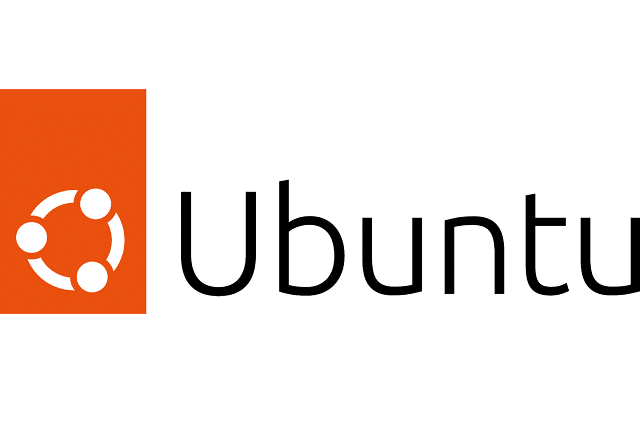
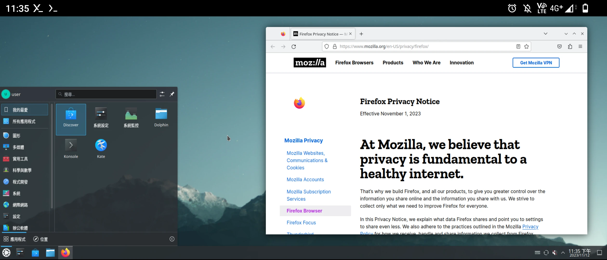
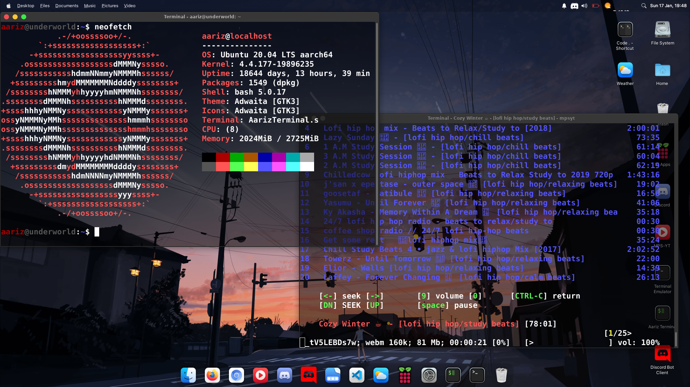

# Solo-Ubuntu: The Ultimate GUI Experience on Termux

<p align="center">
  
</p>

> **Solo-Ubuntu** is a highly optimized, feature-rich Ubuntu environment designed to run seamlessly within Termux on Android devices, providing a full-fledged Graphical User Interface (GUI) via VNC. Experience the power of a desktop operating system right on your mobile device, tailored for developers and power users.

## ✨ Key Features

Solo-Ubuntu is pre-configured with a suite of essential applications and optimizations to ensure a smooth and productive experience:

| Feature | Description | Benefit |
| :--- | :--- | :--- |
| **Full GUI via VNC** | Utilizes a lightweight Desktop Environment (e.g., XFCE) and a VNC server for remote graphical access. | Seamless desktop experience on your Android device. |
| **Developer Tools** | Pre-installed with **VS Code**, **Git**, and **Android Studio** (placeholder for future implementation). | Ready-to-code environment for mobile development and version control. |
| **Web Browsing** | Includes **Mozilla Firefox** for a secure and modern browsing experience. | Full-featured web access within the Linux environment. |
| **Optimized Performance** | Built on a minimal Ubuntu image using \`proot-distro\` for fast startup and low resource consumption. | Quick deployment and efficient use of device resources. |
| **Google Anti-Gravity IDE** | Placeholder for the requested **Google Anti-Gravity IDE** (to be implemented). | Future-proof for advanced development needs. |

## 🚀 Installation

Follow these simple steps to get Solo-Ubuntu up and running on your Termux application.

### Prerequisites

1.  Install **Termux** from the official source (e.g., F-Droid or GitHub).
2.  Ensure your device has at least 4GB of free storage.

### Step-by-Step Guide

1.  **Update Termux and Clone the Repository:**

    ```bash
    yes | pkg update && pkg upgrade
    pkg install git wget -y
    git clone --depth=1 https://github.com/SoloFFFF77/Solo-Ubuntu.git
    cd Solo-Ubuntu
    bash setup.sh
    ```

2.  **Run User Setup:**
    After the initial setup, restart Termux, and run the user configuration script.

    ```bash
    ubuntu
    bash user.sh
    ```
    *(Note: This script will prompt you to set a username and other initial configurations.)*

3.  **Start the GUI Environment:**
    Finally, run the GUI setup script to install the desktop environment and VNC server.

    ```bash
    ubuntu
    sudo bash gui.sh
    ```
    **IMPORTANT:** Note down the VNC password displayed during this step.

## 💻 Usage

Once installed, managing your Solo-Ubuntu environment is straightforward:

| Command | Description |
| :--- | :--- |
| \`ubuntu\` | Enters the Ubuntu command-line environment. |
| \`vncstart\` | Starts the VNC server for graphical access. |
| \`vncstop\` | Stops the running VNC server. |
| \`bash remove.sh\` | Completely removes the Solo-Ubuntu installation. |

### Connecting with VNC Viewer

1.  Install a VNC Viewer application (e.g., RealVNC Viewer) on your Android device.
2.  Create a new connection with the address: \`localhost:1\`.
3.  Enter the VNC password you set during the installation.
4.  Enjoy your full Ubuntu desktop experience!

## 📸 Screenshots

A glimpse into the Solo-Ubuntu desktop environment:

### Professional Desktop View (Firefox Browser)
<p align="center">
  
</p>

### Terminal and System Information (Neofetch)
<p align="center">
  
</p>

## 📜 License

This project is licensed under the **MIT License**. See the [LICENSE](LICENSE) file for details.

## ⭐ Support and Contribution

If you find this project useful, please consider giving it a star on GitHub! Your support helps us continue development and maintenance.

*   **Star the Repository**
*   **Report Issues**
*   **Submit Pull Requests**
